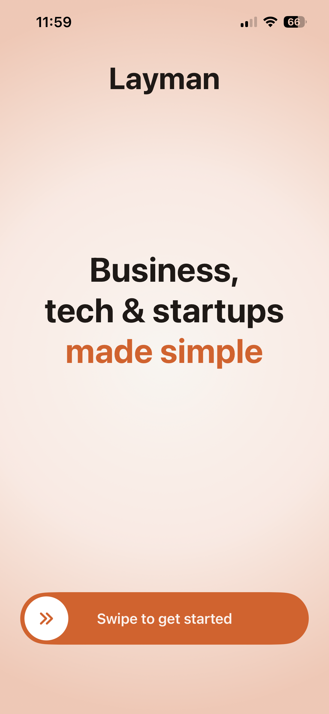
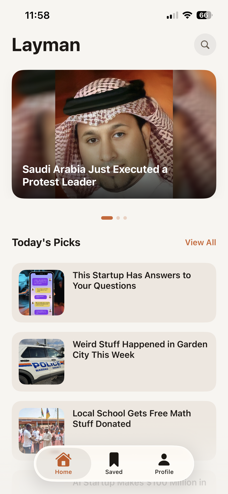
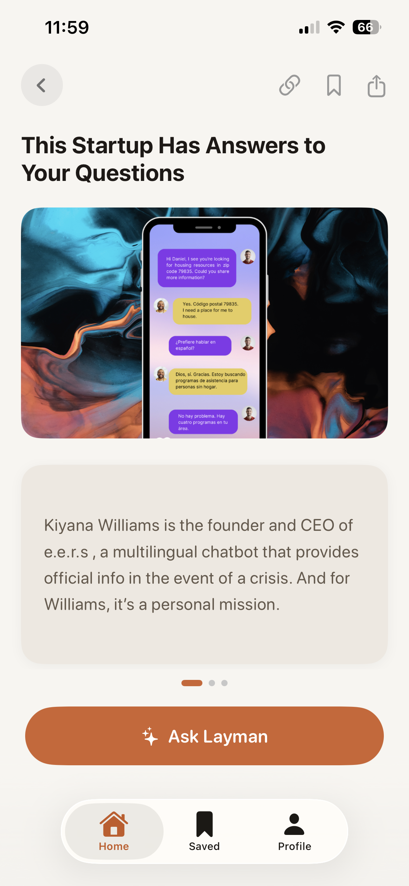
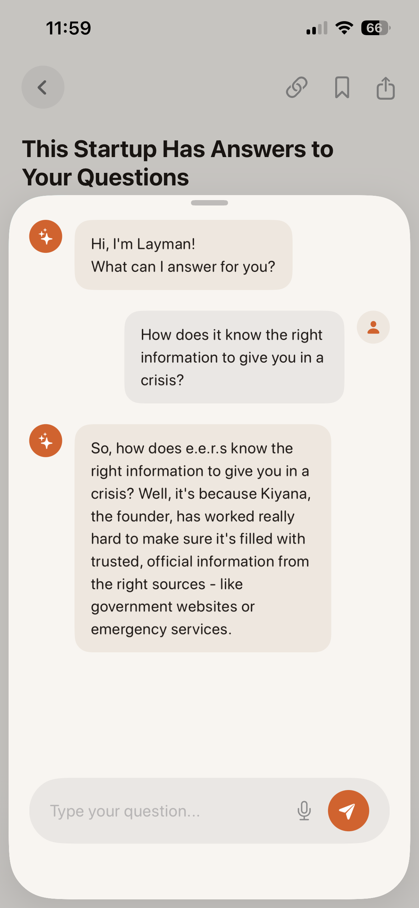
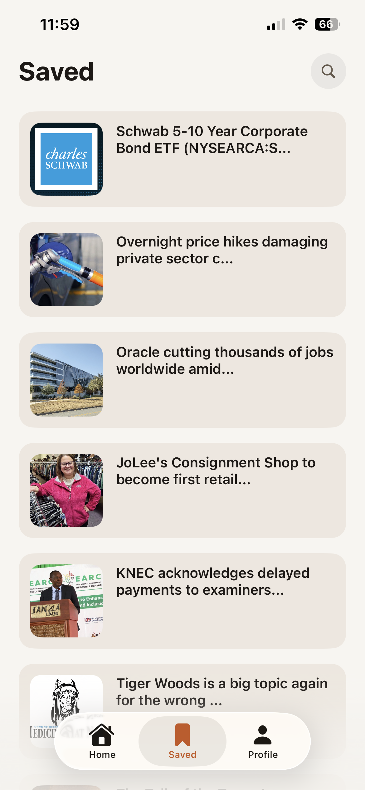

# 📱 Layman — Business, Tech & Startups Made Simple

Layman is a modern iOS news app that simplifies complex business, tech, and startup stories into easy, everyday language using AI.

---

## 🚀 Features

* 🔐 Supabase Authentication (Email/Password)
* 🏠 Home with Featured Carousel + Today’s Picks
* 📖 Article Detail with Swipeable Summary Cards
* 🤖 AI Chat (Ask Layman)
* 🔖 Save Articles (Supabase sync)
* 🌙 Dark Mode Support
* 📳 Haptic Feedback
* 📶 Offline Reading for Saved Articles
* 🔥 Reading Streak Tracking

---

## 🧠 Tech Stack

* **Frontend:** SwiftUI
* **Architecture:** MVVM
* **Backend:** Supabase
* **Database:** PostgreSQL
* **News API:** NewsData.io
* **AI API:** Groq (LLaMA 3.1)

---

## 📂 Project Structure

```
Layman/
├── Views/
├── ViewModels/
├── Models/
├── Services/
├── Utils/
│   ├── Config.swift
│   ├── Theme.swift
```

---

## ⚙️ Setup Instructions

### 1️⃣ Clone Repository

```
git clone https://github.com/sumitkandpal3/Layman.git
cd layman
```

---

### 2️⃣ Supabase Setup

1. Create account: https://supabase.com
2. Create new project
3. Enable Email/Password authentication

### Create Table:

```
create table saved_articles (
  id uuid default uuid_generate_v4() primary key,
  user_id uuid references auth.users(id),
  article_title text,
  article_url text,
  image_url text,
  created_at timestamp default now()
);
```

### Enable Row Level Security:

```
alter table saved_articles enable row level security;

create policy "Users can manage their own articles"
on saved_articles
for all
using (auth.uid() = user_id);
```

---

### 3️⃣ API Keys Configuration

Open **Info.plist** and add the following:

```
SUPABASE_URL
SUPABASE_ANON_KEY
NEWS_API_KEY
GROQ_API_KEY
```

Example:

```
<key>SUPABASE_URL</key>
<string>YOUR_URL</string>

<key>SUPABASE_ANON_KEY</key>
<string>YOUR_KEY</string>

<key>NEWS_API_KEY</key>
<string>YOUR_KEY</string>

<key>GROQ_API_KEY</key>
<string>YOUR_KEY</string>
```

---

### 4️⃣ Install Dependencies

In Xcode:

* File → Add Packages
* Add:

```
https://github.com/supabase/supabase-swift
```

---

### 5️⃣ Run the App

* Open `.xcodeproj`
* Select simulator
* Press **⌘ + R**

---

## 🤖 AI Integration

The app uses Groq API with LLaMA 3.1 model to:

* Generate simplified explanations
* Provide context-aware answers
* Keep responses short (1–2 sentences)

---

## 📸 Screenshots


### Welcome Screen



### Home Screen



### Article Detail



### Chat



### Saved



---

## 🧪 AI Workflow

This project was built using **AI-assisted development (Antigravity)**.

* Feature-by-feature prompting
* Iterative UI refinement
* Debugging via AI interaction
* Structured prompts for clean output

---

## ✨ Highlights

* Pixel-perfect UI matching mockups
* Clean MVVM architecture
* Secure API handling (Info.plist)
* Smooth animations and interactions
* Context-aware AI chatbot

---

## 👨‍💻 Author

**Sumit Kandpal**

---

## 📬 Submission Notes

* Built within 5-day timeline
* Focused on UI fidelity and performance
* Demonstrates effective AI-assisted development

---

## ⭐ Acknowledgements

* Supabase
* NewsData.io
* Groq API
* SwiftUI

---

## 🚀 Final Note

This project showcases how AI tools can accelerate development while maintaining high-quality UI, clean architecture, and real-world functionality.
